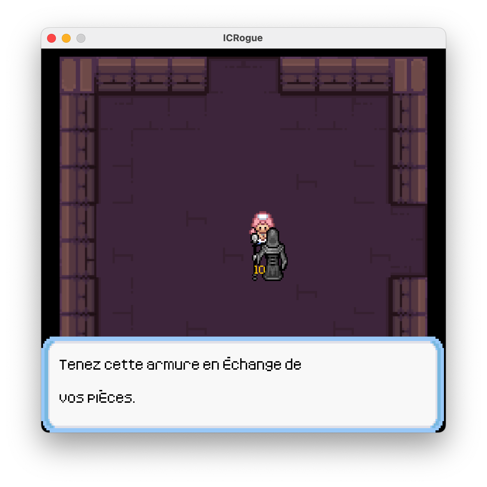
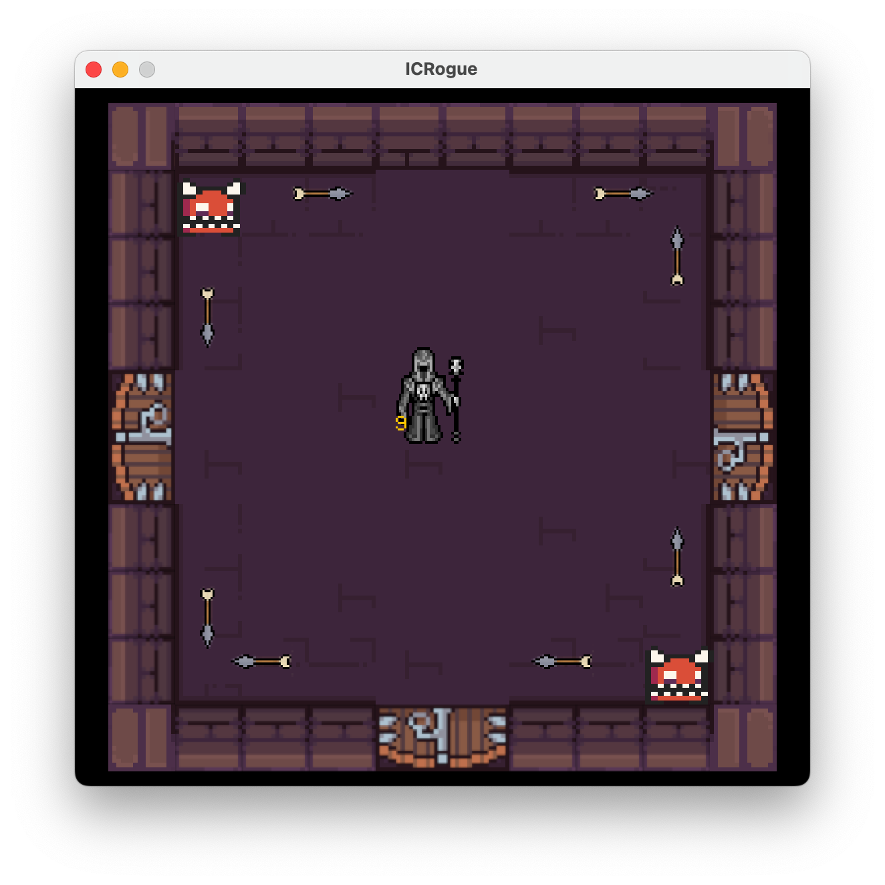
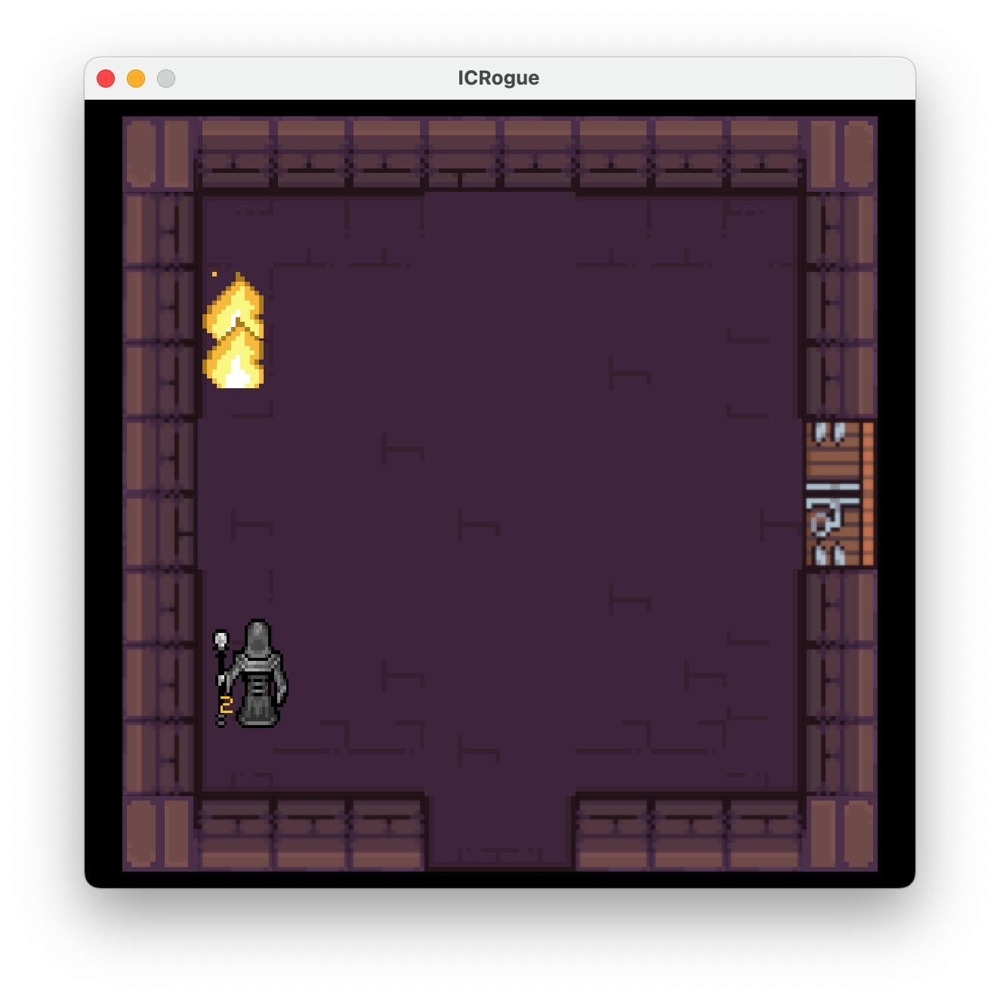
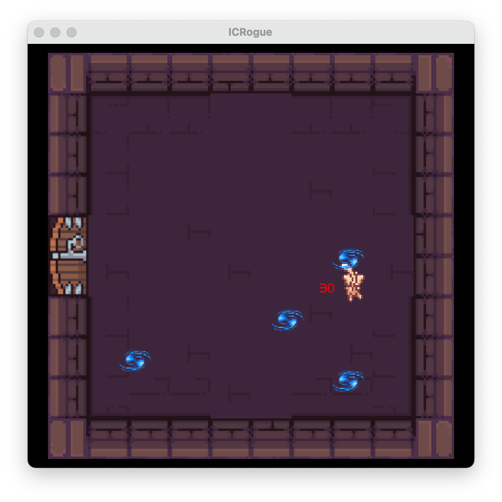

# icRogue

<table>
  <tr>
    <td></td>
    <td></td>
  </tr>
  <tr>
    <td></td>
    <td></td>
  </tr>
</table>

## Introduction
**icRogue** is a dungeon exploration game developed as part of a first-year introductory programming course at EPFL. The objective is to navigate through a mysterious castle, collect items, battle enemies, and ultimately defeat the final boss, Mew. Along the way, players will encounter various rooms containing treasures, challenges, and a merchant who offers valuable upgrades.

Special thanks to Prof. Jamila Sam for the project idea and for developping the game engine. The project is joint effort with my friend Yassine El Graoui.

## Gameplay
### Objective
Your goal is to explore the dungeon, locate the **Boss Room**, and defeat **Mew, the Incarnation of Evil**. However, to access the boss room, you must first find the **key** that unlocks it. Equipping powerful items, such as a magical staff, will increase your chances of survival against Mew.

### Controls
- **Arrow Keys**: Move your character
- **X**: Shoot fireballs
- **H**: Heal using collected items
- **R**: Reset the game
- **W**: Interact with objects from a distance

### Dungeon Exploration
The game offers two modes of dungeon generation:
1. **Randomized Dungeon**: The layout of the dungeon changes with each playthrough, requiring exploration to locate the boss room.
2. **Fixed Dungeon**: The boss room is always positioned left of the starting location, but you still need to find the key before engaging Mew.

Enemies and hazards populate the dungeon, requiring strategic movement and attack timing. Defeating enemies and collecting items will aid you in your quest.

### Boss Battle: Facing Mew
Mew follows a **square movement pattern** and attacks at regular intervals using **Water Balls**, which function similarly to the player's fireballs. Avoiding these attacks and timing your counterattacks are key to victory.

## Game Completion
- **Victory**: After defeating Mew, a message appears declaring your success. You may continue exploring the dungeon if desired.
- **Defeat**: If your health reaches zero, a game-over message appears, and you must restart.
- **Exiting the Game**: Press the close button to exit at any time.

## Features & Enhancements
### New Boss: Mew
- Mew replaces the default turret enemies in a dedicated **Boss Room**.
- Moves in a square pattern and attacks with Water Balls in multiple directions.
- Defeating Mew completes the game.

### Additional Rooms & Items
- **Boss Room (Level0MewRoom)**: The final battle arena.
- **Coin Room (Level0CoinRoom)**: Contains coins that players can collect.
- **Cherry Room**: Features cherries that can be stored and used for healing.

### Collectibles & Upgrades
- **Coins**: Collectable currency used to purchase upgrades.
- **Cherries**: Restore **5 HP** when consumed.
- **Armor**: Purchased from the **Seller**, providing additional protection until it breaks.

### Seller & Dialogues
- **Seller**: A merchant who exchanges coins for armor.
- **Dialogue System**: Introduced via **ICRogueDialogueHandler**, allowing interaction with NPCs like the Seller.
- If you attempt to purchase armor without enough coins, the Seller refuses the transaction.

### Enhanced Player Mechanics
- Players can now equip armor, visually altering their appearance and providing extra HP.
- The HUD displays both **Player HP** and **Armor HP** in distinct colors.

### Combat & Gameplay Improvements
- **Water Balls**: New projectile type used by Mew, mirroring the player's fireballs.
- **Projectile Countering**: Fireballs and enemy projectiles cancel each other out upon collision.
- **Room Challenges**: Players must complete room-specific objectives before exiting.

### Map & Level Adjustments
- Added new rooms to **Level0** and updated the dungeon generation algorithm to accommodate them.
- Adjusted room placement logic to ensure a more engaging dungeon layout.

## Additional Notes
- **Hidden Easter Egg**: A cherry is secretly placed somewhere in the dungeon.
- **Player Advice**: Avoid melee combat with Mew—it will not end well.
- **Enjoy the Game!** While icRogue is not quite a Zelda, it offers an engaging dungeon-crawling experience.

---

Enjoy exploring, battling, and conquering the dungeon in **icRogue**!

